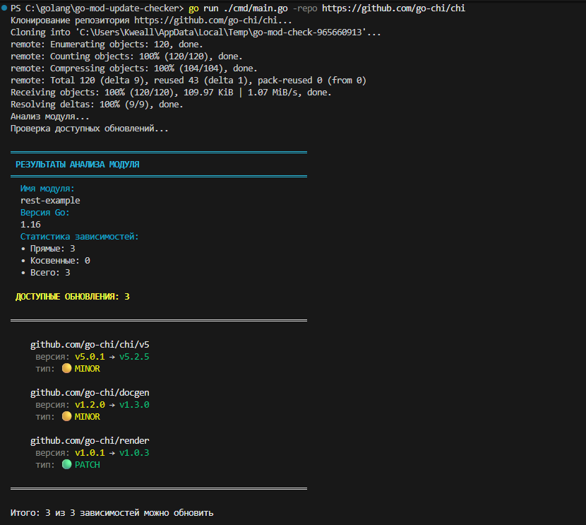

# Go Module Update Checker

CLI-утилита для анализа Go модулей и проверки доступных обновлений зависимостей. Нужно лишь указать URL Git-репозитория и вы получите следующую информацию: Имя модуля, версию Go, список зависимостей, которые можно обновить.

## Возможности

- **Клонирование репозитория** - автоматическое клонирование по URL
- **Анализ go.mod** - парсинг модуля и его зависимостей
- **Статистика зависимостей** - подсчет прямых и косвенных (indirect) зависимостей
- **Проверка обновлений** - поиск последних версий для каждой зависимости
- **Цветной вывод** - наглядное отображение с помощью `fatih/color`
- **JSON вывод** - поддержка машинно-читаемого формата
- **Быстрый анализ** - клонирование с `--depth=1` для экономии времени

## Установка

```bash
# Клонируем репозиторий
git clone https://github.com/yourusername/go-mod-update-checker.git
cd go-mod-update-checker
```

## Использование

### Базовый запуск

```bash
# Простой анализ модуля
go run ./cmd main.go -repo https://github.com/go-chi/chi

# Анализ с JSON выводом
go run ./cmd main.go -repo https://github.com/go-chi/chi -json

# Показать справку
go run ./cmd main.go -help
```

### Пример вывода



```
Анализ модуля...
Проверка доступных обновлений...

════════════════════════════════════════════════════════════
 РЕЗУЛЬТАТЫ АНАЛИЗА МОДУЛЯ
════════════════════════════════════════════════════════════
  Имя модуля:
  rest-example
  Версия Go:
  1.16
  Статистика зависимостей:
  • Прямые: 3
  • Косвенные: 0
  • Всего: 3

 ДОСТУПНЫЕ ОБНОВЛЕНИЯ: 3

════════════════════════════════════════════════════════════

    github.com/go-chi/chi/v5
     версия: v5.0.1 → v5.2.5
     тип: 🟡 MINOR

    github.com/go-chi/docgen
     версия: v1.2.0 → v1.3.0
     тип: 🟡 MINOR

    github.com/go-chi/render
     версия: v1.0.1 → v1.0.3
     тип: 🟢 PATCH

════════════════════════════════════════════════════════════

Итого: 3 из 3 зависимостей можно обновить

```

## Аргументы командной строки 

| Флаг | Описание | Обязательный |
|------|----------|--------------|
| `-repo` | URL Git репозитория (например, https://github.com/user/repo) | Да |
| `-json` | Вывод результатов в JSON формате | Нет |
| `-help` | Показать справку | Нет |

## Зависимости

- [fatih/color](https://github.com/fatih/color) - цветной вывод в терминал
- [golang.org/x/mod](https://pkg.go.dev/golang.org/x/mod) - работа с Go модулями